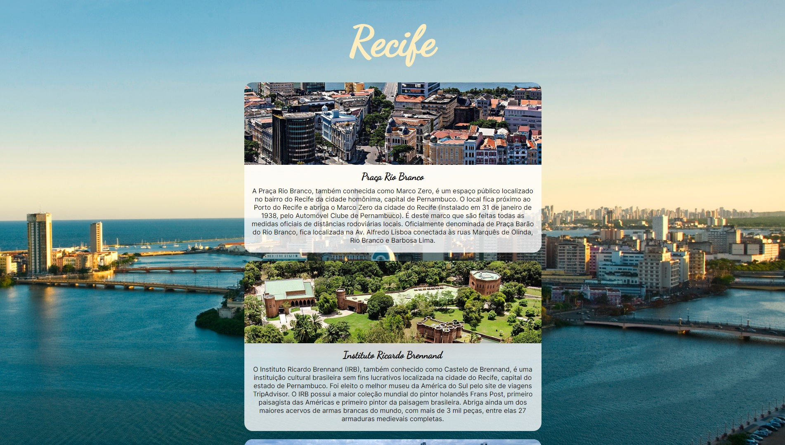
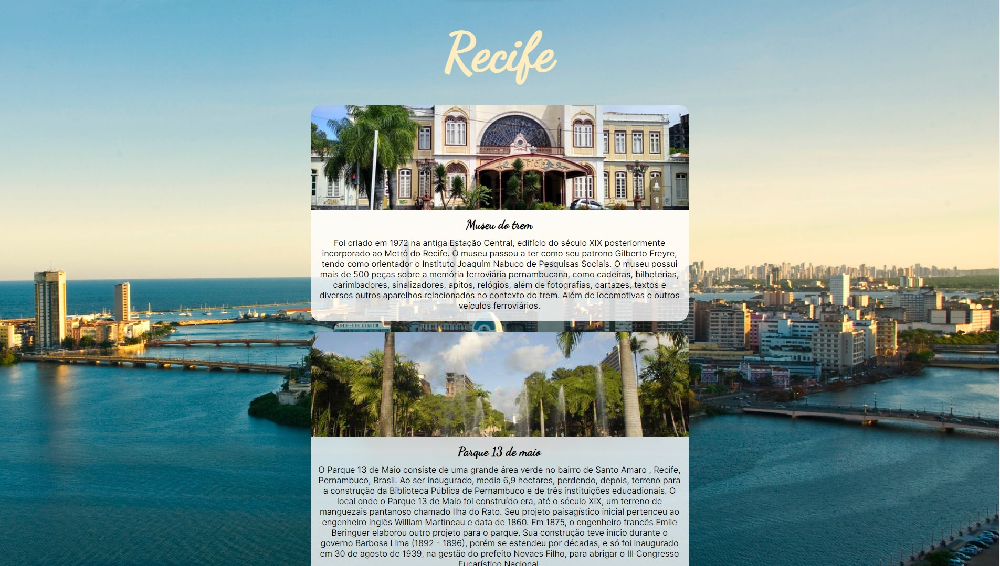
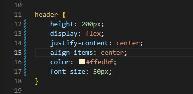

Exercício 03 da Unidade Html/css do curso da Softex

A cidade do Recife é uma das mais famosas do Nordeste, ela possui diversos pontos turísticos 
e um deles é o Marco Zero. Sabendo disso, crie uma página HTML, falando sobre esse ponto 
turístico de acordo com os seguintes pré-requisitos: 

1. A página precisa ter cabeçalho, conteúdo e rodapé; 
2. A página precisa ter imagens; 
3. Use a tag de semântica textual inline. 

Abuse de sua criatividade para a criação da página! 

Preview:

Preview pág 2:

Preview 3, parte do código usando as propriedades flex box no cabeçalho da página:

